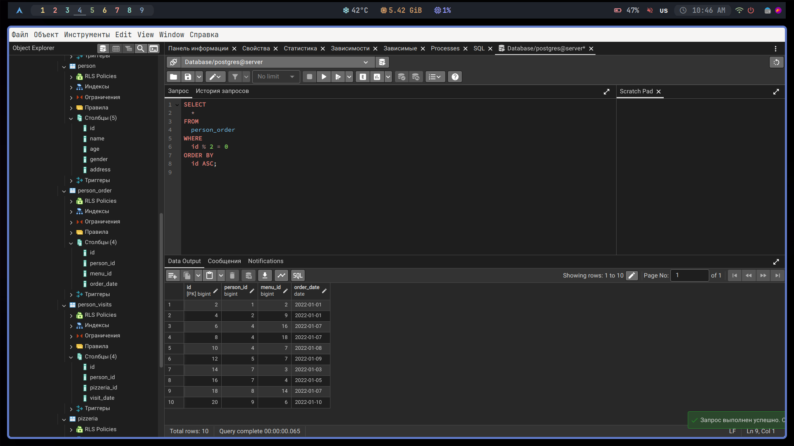
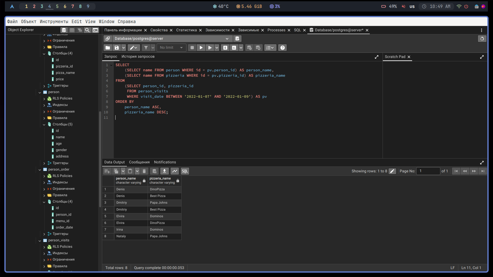

# Answers for day 00

Day00_ex00:


```sql
SELECT
  name,
  age
FROM
  person
WHERE
  address = 'Kazan';
```

Day00_ex01:


```sql
SELECT
  name,
  age
FROM
  person
WHERE
  address = 'Kazan'
  AND gender = 'female'
ORDER BY
  name;
```

Day00_ex02:


```sql
SELECT
  name,
  rating
FROM
  pizzeria
WHERE
  rating >= 3.5
  AND rating <= 5
ORDER BY
  rating;
```


```sql
SELECT
  name,
  rating
FROM
  pizzeria
WHERE
  rating BETWEEN 3.5
  AND 5
ORDER BY
  rating;
```

Day00_ex03:


```sql
SELECT
  DISTINCT person_id
FROM
  person_visits
WHERE
  (
    visit_date BETWEEN '2022-01-06'
    AND '2022-01-09'
  )
  OR (pizzeria_id = 2)
ORDER BY
  person_id DESC;
```

Day00_ex04:


```sql
SELECT
  CONCAT(
    name, ' (age:', age, ', gender:', gender,
    ', address:', address, ')'
  ) AS person
FROM
  person
ORDER BY
  person ASC;
```

Day00_ex05:


```sql
SELECT
  name
FROM
  person
WHERE
  id IN (
    SELECT
      person_id
    FROM
      person_order
    WHERE
      menu_id IN (13, 14, 18)
      AND order_date = '2022-01-07'
  );
```

Day00_ex06:


```sql
SELECT
    name,
    CASE
        WHEN EXISTS (
            SELECT 1
            FROM person_order
            WHERE person_order.person_id = person.id
            AND menu_id IN (13, 14, 18)
            AND order_date = '2022-01-07'
        ) THEN 'Has Order'
        ELSE 'No Order'
    END AS check_name
FROM
    person
WHERE
    id IN (
        SELECT
            person_id
        FROM
            person_order
        WHERE
            menu_id IN (13, 14, 18)
            AND order_date = '2022-01-07'
    );
```

Day00_ex07:


```sql
SELECT
    name,
    age,
    gender,
    address,
    CONCAT(name, ' (age:', age, ', gender:', gender, ', address:', address, ')') AS person_information,
    CASE
        WHEN age >= 18 THEN 'Adult'
        ELSE 'Minor'
    END AS check_name
FROM
    person
ORDER BY
    person_information ASC;
```

Day00_ex08:


```sql
SELECT
  *
FROM
  person_order
WHERE
  id % 2 = 0
ORDER BY
  id ASC;
```

Day00_ex09:


```sql
SELECT
    (SELECT name FROM person WHERE id = pv.person_id) AS person_name,
    (SELECT name FROM pizzeria WHERE id = pv.pizzeria_id) AS pizzeria_name
FROM
    (SELECT person_id, pizzeria_id
     FROM person_visits
     WHERE visit_date BETWEEN '2022-01-07' AND '2022-01-09') AS pv
ORDER BY
    person_name ASC,
    pizzeria_name DESC;
```
